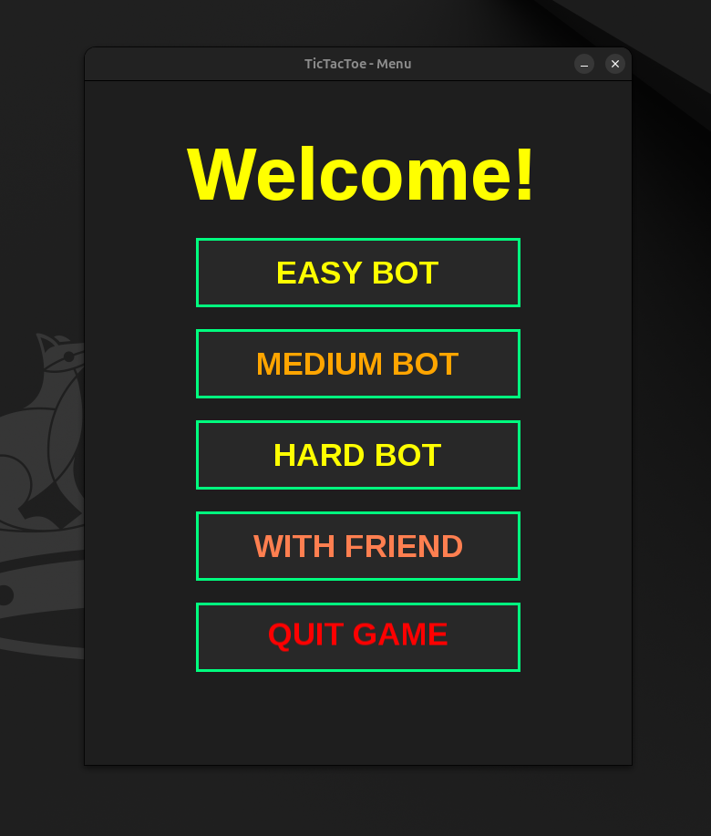
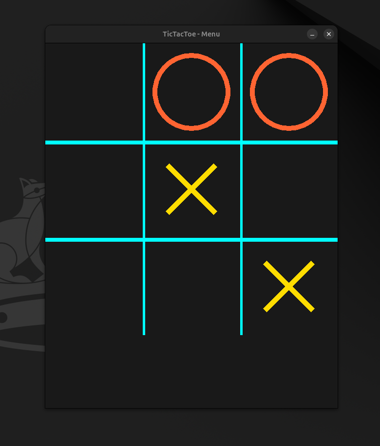
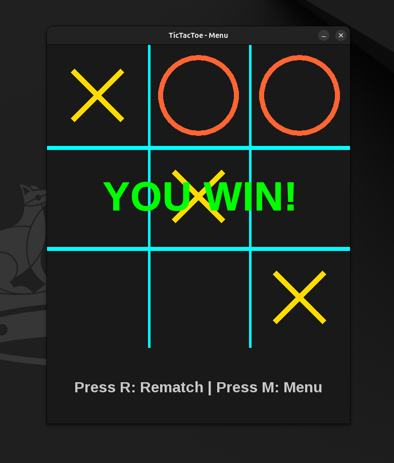

# 🕹️ TicTacToe Game

A modern, high-performance Tic-Tac-Toe game developed in **C++** using the **SFML** library. This project features a sleek **Neon/Cyberpunk** aesthetic, advanced AI opponents, and a robust architecture designed for Linux environments.

---

## 🌟 Key Features

* **Neon Visual Engine:** Custom-rendered UI with animations, vibrant colors, and glow effects.
* **Three AI Difficulty Levels:**
    * **Easy:** Makes random moves—perfect for beginners.
    * **Medium:** Balanced gameplay; blocks the player and takes winning opportunities.
    * **Hard (Impenetrable):** Powered by the **Minimax algorithm**, making it mathematically impossible to beat.
* **Local Multiplayer:** Classic "With Friend" mode for competitive play on the same machine.
* **Smart UI System:** Includes a main menu, dynamic game board, and a Game Over screen with Rematch/Menu options.
* **Linux Integration:** Fully optimized for Linux with automated launch scripts and desktop launcher support.

---

## 🛠️ Technical Stack

* **Language:** C++20
* **Graphics & Input:** SFML (Simple and Fast Multimedia Library)
* **Build System:** CMake
* **Target OS:** Linux (Tested on Ubuntu/Debian/Pop!_OS)

---

## 📂 Complete Project Structure

```text
TicTacToe/
├── assets/                  # Game resources (fonts, icons)
│   ├── fonts/               # UI Typography (font.ttf)
│   └── icon.png             # Official game icon
├── include/                 # Header files (.hpp) - The "Blueprints"
│   ├── Core/                # Engine logic (GameEngine, Board, Constants)
│   ├── Graphics/            # Visual components (Renderer, MenuButton)
│   └── Players/             # AI and Player definitions (Player, EasyBot, HardBot)
├── src/                     # Source files (.cpp) - The "Engine"
│   ├── Core/                # Implementation of game flow and rules
│   ├── Graphics/            # Logic for drawing neon elements and UI
│   └── Players/             # Algorithms for AI logic and human input
├── libs/                    # Shared libraries (.so) for Linux portability
├── cmake-build-release/     # Optimized production build directory
├── CMakeLists.txt           # Project configuration for CMake
├── StartGame.sh             # Automated Linux launcher script
└── TicTacToe_Work.desktop   # Desktop shortcut for quick access
```

---

## 🚀 Deployment & Installation

### For Developers (Cloning the repo)
1. **Clone** the repository to your local machine.
2. **Open** the project in your favorite IDE (CLion is highly recommended).
3. Set the CMake build profile to **Release** for maximum performance and smaller binary size.
4. **Build** and **Run**.

### For Players (Standalone Linux)
The game is designed to be "Plug & Play" on most Linux distributions:

1. **Ensure the launch script is executable:**
   ```bash
   chmod +x StartGame.sh
   ```

2. **Run the game:**
    ```Bash
    ./StartGame.sh
    ```

    **Note:** To use the Desktop icon launcher, right-click TicTacToe_Work.desktop and select "Allow Launching". This will transform the file into a clickable icon with the official game logo.

---
### 🧪 Platform Testing & Compatibility
* ***Linux:*** Fully tested and verified. The inclusion of the libs/ folder ensures that the game runs smoothly even on systems where SFML is not pre-installed.
* ***Windows/macOS:*** Currently not supported in the standalone release, but the source code is cross-platform ready and will be adapted for these systems in future updates.

---
### 🔮 Roadmap (Coming Soon)
*   ***Remote Multiplayer:*** Implementing real-time remote play over the internet using TCP/IP Sockets.
*   ***Cross-Platform Support:*** Native .exe installers for Windows and .app bundles for macOS.
*   ***Audio Update:*** Adding retro-futuristic sound effects and a synthwave background soundtrack.

---
### 📸 Visual Showcase

Here is a glimpse of the **Neon Aesthetic** and the different game modes:

<p align="center">
  
   
  
</p>

---
### 👨‍💻 Author
Flavius - Lead Developer - [GitHub Profile](https://github.com/FlaviusMarian27)